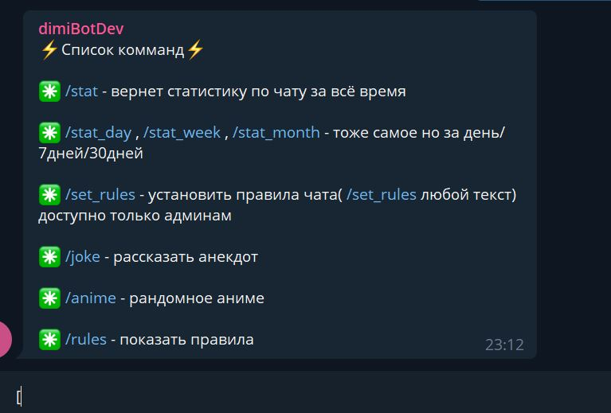
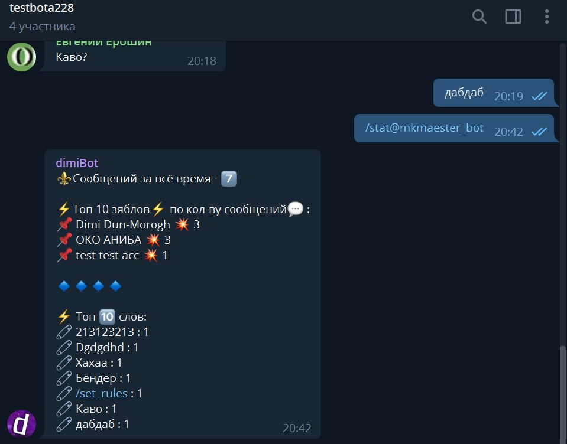
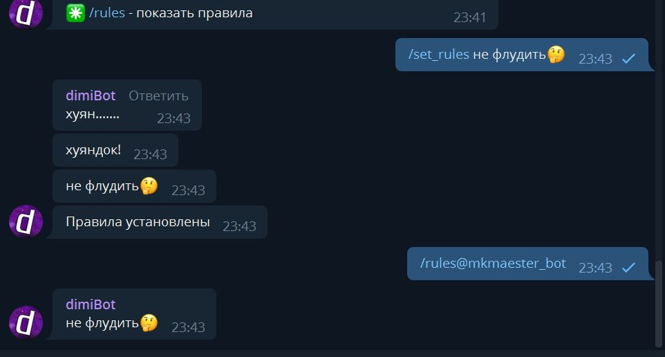
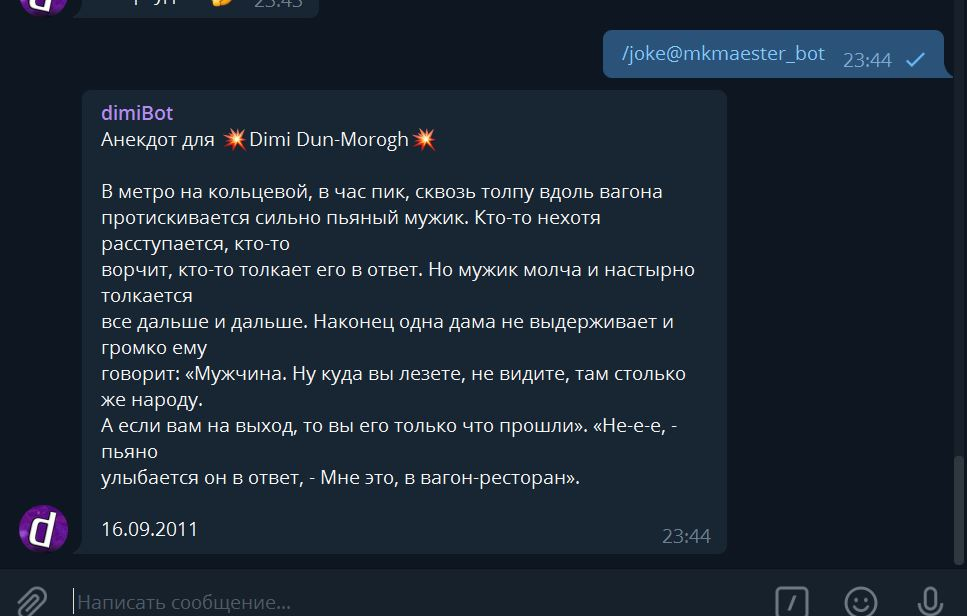
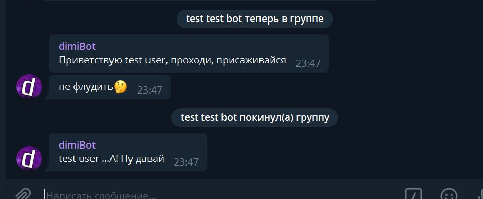
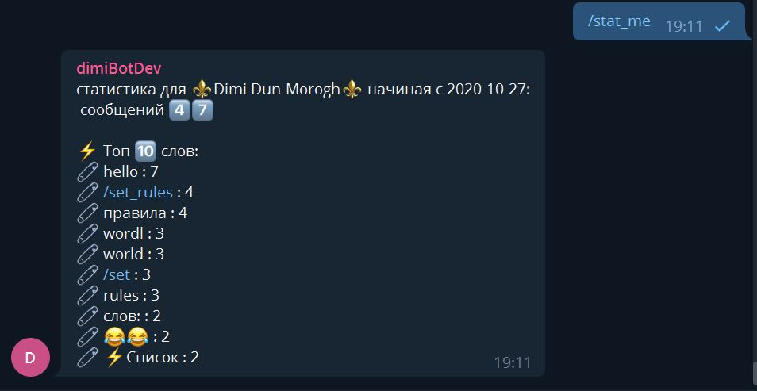
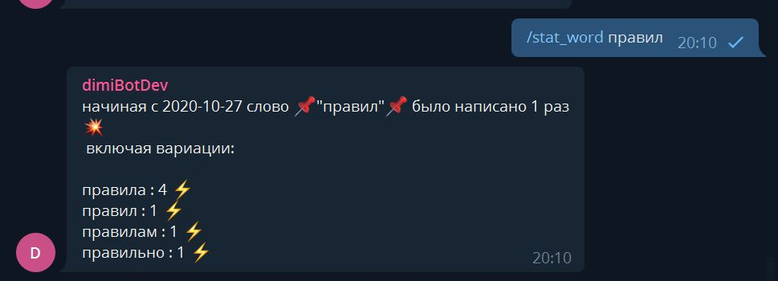

# dimiBot
> telegram bot that let's you monitor chat activity, post activity statistics for top 10 users and also for most used words. Stats are avalaible for different time periods(1 day, 7 days, 30, entire history); Also bot can post jokes, set and retrieve chat rules, greet new members of chat and farewell those who leave

bot is avalaible under this link - https://t.me/mkmaester_bot  
list of bot's commands can be seen on screenshots below:
##### /help

##### /stat

##### /set_rules & /rules

##### /joke

##### /anime

##### greetings

##### /stat_me

##### /stat_word

####log:

- [x] create a function/controller to get all msg's for specific amount of time (currentDay,last 7 days, last 30 days)(20.10.2020) ✅
- [x] create a function to count messages for each user (20.10.2020) ✅
- [x] create a function to count most used words in messages (20.10.2020) ✅
- [x] create a function to render string with all the stats(message count, words count etc) (25.10.2020) ✅
- [x] create a number to emoji string helpers/function (25.10.2020) ✅
- [ ] implement a daily statistics post message ( setInterval maybe?)
- [x] implement a greeting new member logic (27.10.2020) ✅
- [ ] refactor data-base, crud methods, message strings should be put in array of chat/user document
- [x] implement a logic to parse jokes from some site and post them with bot command (29.10.2020) ✅
- [x] implement get/set rules for chat (28.10.2020) ✅
- [ ] migrate to TypeScript